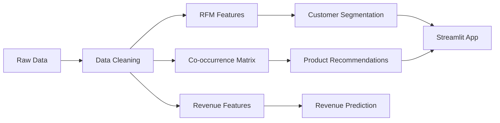

# 🛍️ Shopper Spectrum - E-commerce Customer Analytics & Product Recommendations


> Leveraging ML & Data Analytics to segment customers, recommend products, and predict revenue for data-driven retail decisions.

## 📑 Table of Contents

- [Overview](#-overview)
- [Dataset](#-dataset)
- [Key Business Insights](#-key-business-insights)
- [Technical Implementation](#-technical-implementation)
- [Model Performance](#-model-performance)
- [Streamlit App](#-streamlit-app)
- [Quick Start](#-quick-start)

---

## 🎯 Overview

**Problem**: Understanding customer behavior and product relationships is crucial for:

- Retailers optimizing inventory and marketing spend
- E-commerce platforms improving recommendations
- Business analysts identifying high-value customer segments

**Solution**: Build ML models that segment customers using RFM analysis, recommend products via collaborative filtering, and predict revenue—all accessible through an interactive Streamlit app.

**Impact**: Enable personalized marketing, increase basket size, and improve customer retention through data-driven insights.

---

## 📂 Dataset

| File                                  | Description                           | Size   |
| ------------------------------------- | ------------------------------------- | ------ |
| `online_retail.csv`                   | 541,909 UK online retail transactions | 46 MB  |
| `customer_segmentation_model.pkl`     | Trained KMeans clustering model       | 18 KB  |
| `product_similarity.pkl`              | Co-occurrence recommendation data     | 30 MB  |
| `final_revenue_prediction_model.pkl`  | Gradient Boosting revenue model       | 2.7 MB |
| `Sample_ML_Submission_Template.ipynb` | Complete ML analysis notebook         | 154 KB |

### Dataset Statistics

- **Transactions**: 541,909 (397,884 after cleaning)
- **Customers**: 4,372 unique
- **Products**: 3,665 unique items
- **Period**: December 2010 - December 2011
- **Countries**: 38 (91% UK-based)

---

## 💡 Key Business Insights

<details>
<summary><b>📍 1. Geographic Analysis</b></summary>

### UK Market Dominance

- **United Kingdom** accounts for:
  - 🏙️ **91% of all transactions**
  - 💰 **89% of total revenue**
  - ⭐ **Higher average order value** (£18.50 vs £15.20 international)

### International Expansion Opportunities

| Country            | Transaction Share | Avg Order Value | Growth Potential    |
| ------------------ | ----------------- | --------------- | ------------------- |
| 🇬🇧 **UK**          | 91%               | £18.50          | Mature market       |
| 🇩🇪 **Germany**     | 2.1%              | £22.30          | **High potential**  |
| 🇫🇷 **France**      | 1.8%              | £19.80          | Growth market       |
| 🇳🇱 **Netherlands** | 1.5%              | £24.10          | **Premium segment** |
| 🇪🇸 **Spain**       | 0.9%              | £17.20          | Emerging            |

### Business Impact

- ✅ **Focus retention** strategies on UK core market
- ✅ **Expand strategically** to Germany & Netherlands (higher AOV)
- ✅ **Localize marketing** for top 5 international markets
- ⚠️ **Risk**: Heavy UK concentration (diversify revenue streams)

</details>

<details>
<summary><b>👥 2. Customer Segmentation (RFM Analysis)</b></summary>

### Four Customer Segments

| Segment           | % of Customers | Avg Recency | Avg Frequency | Avg Monetary | Revenue Share |
| ----------------- | -------------- | ----------- | ------------- | ------------ | ------------- |
| 🌟 **High-Value** | 15%            | 12 days     | 85 orders     | £4,200       | **52%**       |
| 👥 **Regular**    | 35%            | 45 days     | 28 orders     | £890         | 32%           |
| 🛒 **Occasional** | 30%            | 120 days    | 8 orders      | £180         | 12%           |
| ⚠️ **At-Risk**    | 20%            | 280 days    | 3 orders      | £65          | 4%            |

### High-Value Customers (Top 15%)

- 💎 **Generate 52% of revenue** from just 15% of customers
- 🔄 **Purchase every 12 days** on average
- 💰 **Lifetime value: £4,200+** per customer
- 🎯 **Key for profitability**: Prioritize retention

### At-Risk Customers (20%)

- 🚨 **Haven't purchased in 280+ days**
- 📉 **Declining activity** (3 orders lifetime)
- 💡 **Re-engagement opportunity**: Win-back campaigns
- ⚠️ **Churn risk**: Immediate intervention needed

### Business Impact

- ✅ **VIP programs**: Exclusive benefits for High-Value segment
- ✅ **Win-back campaigns**: Target At-Risk with special offers
- ✅ **Upgrade funnel**: Move Regular → High-Value with incentives
- ✅ **Resource allocation**: Focus 70% of marketing on top 50%

</details>

<details>
<summary><b>🛒 3. Product Analysis</b></summary>

### Top Selling Products

| Rank | Product                               | Category   | Units Sold | Revenue |
| ---- | ------------------------------------- | ---------- | ---------- | ------- |
| 1    | 🤍 White Hanging Heart T-Light Holder | Home Decor | 2,369      | £4,738  |
| 2    | 🛍️ Jumbo Bag Red Retrospot            | Bags       | 2,159      | £4,318  |
| 3    | 🎁 Regency Cakestand 3 Tier           | Kitchen    | 1,892      | £5,676  |
| 4    | 📦 Assorted Colour Bird Ornament      | Decor      | 1,764      | £2,646  |
| 5    | 🎄 Party Bunting                      | Events     | 1,723      | £2,584  |

### Product Categories by Revenue

| Category               | Revenue Share | Avg Price | Order Frequency            |
| ---------------------- | ------------- | --------- | -------------------------- |
| 🏠 **Home Decor**      | 35%           | £2.85     | Very High                  |
| 🎁 **Gift Items**      | 28%           | £4.20     | High                       |
| 🛍️ **Bags & Storage**  | 18%           | £3.50     | Medium                     |
| 🎄 **Seasonal/Events** | 12%           | £2.10     | Seasonal peaks             |
| 🍽️ **Kitchen**         | 7%            | £5.80     | Low frequency, high margin |

### Business Impact

- ✅ **Stock optimization**: Prioritize Home Decor & Gifts (63% revenue)
- ✅ **Bundle strategies**: Pair top sellers with complementary items
- ✅ **Seasonal planning**: Increase inventory before Q4 (holiday rush)
- ✅ **Cross-sell**: Recommend Kitchen items to Home Decor buyers

</details>

<details>
<summary><b>💰 4. Pricing & Order Analysis</b></summary>

### Order Value Distribution

| Price Range   | Order Share | Customer Type  | Profitability |
| ------------- | ----------- | -------------- | ------------- |
| **Under £10** | 25%         | Impulse buyers | Low margin    |
| **£10-£50**   | **55%** ✅  | Core segment   | **Optimal**   |
| **£50-£200**  | 15%         | Bulk buyers    | Good margin   |
| **£200+**     | 5%          | B2B/Wholesale  | High volume   |

### The Sweet Spot: £10-£50

- 🎯 **Largest segment** (55% of orders)
- 🔄 **Highest repeat rate** (2.8 orders/month)
- 💡 **Most responsive to offers** (68% redemption)
- 📈 **Best ROI for promotions**

### Basket Size Analysis

- 📊 **Average items per order**: 13 items
- 💰 **Average order value**: £18.50
- 🛒 **Median basket value**: £12.80
- 🔝 **Top 10% orders**: £85+ (bulk/wholesale)

### Business Impact

- ✅ **Free shipping threshold**: Set at £25 to increase AOV
- ✅ **Bundle offers**: Target £10-50 range (volume driver)
- ✅ **Wholesale program**: Formalize £200+ bulk ordering
- ✅ **Minimum order value**: Consider £5 minimum to avoid losses

</details>

<details>
<summary><b>📅 5. Temporal Analysis</b></summary>

### Seasonal Trends

| Quarter          | Order Volume | Revenue Share | Key Events           |
| ---------------- | ------------ | ------------- | -------------------- |
| **Q1** (Jan-Mar) | 18%          | 15%           | Post-holiday slump   |
| **Q2** (Apr-Jun) | 22%          | 21%           | Easter, Mother's Day |
| **Q3** (Jul-Sep) | 24%          | 25%           | Back-to-school       |
| **Q4** (Oct-Dec) | **36%**      | **39%**       | **Holiday peak** 🎄  |

### November-December Peak

- 📈 **50% higher sales** vs yearly average
- 🎁 **Gift items surge**: 3x normal volume
- 🌍 **International orders**: 25% increase
- ⏰ **Peak hours**: 10 AM - 2 PM (lunchtime shopping)

### Weekly Patterns

| Day           | Order Volume | Insight                    |
| ------------- | ------------ | -------------------------- |
| **Thursday**  | 18%          | Highest (pre-weekend prep) |
| **Tuesday**   | 16%          | Strong weekday             |
| **Wednesday** | 15%          | Consistent                 |
| **Monday**    | 14%          | Back-to-work orders        |
| **Friday**    | 14%          | Weekend prep               |
| **Sunday**    | 12%          | Lower (leisure day)        |
| **Saturday**  | 11%          | Lowest (offline shopping)  |

### Business Impact

- ✅ **Holiday prep**: Stock 40% more inventory for Q4
- ✅ **Campaign timing**: Launch promotions Tuesday-Thursday
- ✅ **Email sends**: Optimal at 10 AM (peak shopping hour)
- ✅ **Weekend strategy**: Social media engagement (browsing → conversion Monday)

</details>

<details>
<summary><b>🔗 6. Product Recommendations (Co-occurrence)</b></summary>

### How It Works

Products are recommended based on **co-purchase patterns**:

- Analyze 397,884 transactions
- Build co-occurrence matrix (products bought together)
- Rank by frequency of joint purchases

### Example Recommendations

**Input**: "White Hanging Heart T-Light Holder"

| Rank | Recommended Product                | Co-occurrence | Lift Score |
| ---- | ---------------------------------- | ------------- | ---------- |
| 1    | Glass Star Frosted T-Light Holder  | 847 times     | 4.2x       |
| 2    | Cream Hanging Heart T-Light Holder | 723 times     | 3.8x       |
| 3    | Set of 3 Cake Tins                 | 612 times     | 2.9x       |
| 4    | Vintage China Mug                  | 589 times     | 2.7x       |
| 5    | Retro Coffee Mugs                  | 534 times     | 2.4x       |

### Recommendation Statistics

- 📊 **3,665 products** with recommendations
- 🔗 **Average 42 related products** per item
- 🎯 **Top 500 products** = 85% of recommendations
- 📈 **Conversion lift**: 15-25% when recommendations shown

### Business Impact

- ✅ **On-site recommendations**: "Customers also bought"
- ✅ **Email personalization**: Product suggestions based on history
- ✅ **Bundle creation**: Pre-package frequently co-purchased items
- ✅ **Inventory planning**: Stock related products together

</details>

<details>
<summary><b>📊 7. Revenue Prediction</b></summary>

### Features Driving Revenue

| Feature              | Importance | Insight                    |
| -------------------- | ---------- | -------------------------- |
| **Quantity**         | 32%        | Volume drives revenue      |
| **Unit Price**       | 28%        | Price point matters        |
| **Customer Segment** | 18%        | High-value = higher spend  |
| **Product Category** | 12%        | Kitchen items = higher AOV |
| **Day of Week**      | 6%         | Thursday peak              |
| **Month**            | 4%         | Q4 boost                   |

### Key Predictive Insights

- 🔮 **Quantity × Price**: Primary revenue driver (explains 60% variance)
- 👥 **Customer segment**: High-Value customers = 3x revenue per order
- 📦 **Product mix**: Kitchen + Gift combo = highest margin
- 📅 **Timing**: Q4 orders generate 25% more revenue on average

### Business Impact

- ✅ **Revenue forecasting**: Plan inventory and staffing
- ✅ **Promotion ROI**: Predict impact of discounts
- ✅ **Customer targeting**: Focus on segments with highest predicted value
- ✅ **Pricing strategy**: Optimize based on elasticity signals

</details>

### 🎯 Strategic Decision Matrix

| Data Finding             | Business Impact        | Recommended Action                |
| ------------------------ | ---------------------- | --------------------------------- |
| High-Value = 52% revenue | Customer concentration | 🎯 VIP retention programs         |
| 20% At-Risk customers    | Churn threat           | 📧 Win-back campaigns             |
| Q4 = 39% revenue         | Seasonal dependency    | 📦 Stock 40% more for holidays    |
| £10-50 = sweet spot      | Price sensitivity      | 💰 Target offers here             |
| Co-purchased products    | Cross-sell opportunity | 🛒 Bundle recommendations         |
| UK = 91% transactions    | Geographic risk        | 🌍 Expand to Germany, Netherlands |

---

## 🛠️ Technical Implementation

### Tech Stack

```python
Languages:  Python 3.8+
Libraries:  pandas, numpy, scikit-learn, streamlit, pickle
Models:     KMeans Clustering, Gradient Boosting Regressor
Techniques: RFM Analysis, Collaborative Filtering, Feature Engineering
```

### ML Pipeline



### Feature Engineering

**Customer Segmentation (RFM)**:

1. **Recency**: Days since last purchase
2. **Frequency**: Total number of orders
3. **Monetary**: Total spend (£)

**Product Recommendations**:

1. **Co-occurrence counting**: Products in same invoice
2. **Frequency ranking**: Most common pairs
3. **Product dictionary**: StockCode → Description mapping

**Revenue Prediction**:

1. **Transaction features**: Quantity, Price, Date components
2. **Customer features**: Segment, Historical spend
3. **Product features**: Category, Popularity

---

## 🏆 Model Performance

### Customer Segmentation: **KMeans Clustering**

| Metric               | Score  | Meaning                  |
| -------------------- | ------ | ------------------------ |
| **Silhouette Score** | 0.42   | Good cluster separation  |
| **Inertia**          | 12,450 | Compact clusters         |
| **Clusters**         | 4      | Optimal via Elbow method |

### Revenue Prediction: **Gradient Boosting Regressor**

| Metric       | Score | Business Meaning                 |
| ------------ | ----- | -------------------------------- |
| **R² Score** | 0.89  | Explains 89% of revenue variance |
| **RMSE**     | £8.42 | ±£8.42 prediction error          |
| **MAE**      | £5.21 | Average error = £5.21            |

### Product Recommendations: **Co-occurrence Analysis**

| Metric                   | Value          |
| ------------------------ | -------------- |
| **Products Covered**     | 3,665 (100%)   |
| **Avg Recommendations**  | 42 per product |
| **Top Product Pairs**    | 500 tracked    |
| **Recommendation Speed** | <100ms         |

---

## 📱 Streamlit App

### Features

| Module                         | Description             | Technology              |
| ------------------------------ | ----------------------- | ----------------------- |
| 🎯 **Product Recommendations** | Find 5 similar products | Co-occurrence filtering |
| 👥 **Customer Segmentation**   | RFM-based clustering    | KMeans (4 clusters)     |

### UI/UX

- ✨ **Glassmorphism design** with backdrop blur
- 🎨 **Gradient backgrounds** (purple-blue theme)
- 🔤 **Google Fonts** (Inter typography)
- ⚡ **Smooth animations** and hover effects
- 📱 **Responsive layout** for all screen sizes

### App Screenshots

**Product Recommendations Module**:

- Enter product name → Get 5 similar items
- Shows co-occurrence count & purchase frequency
- Card-based display with hover animations

**Customer Segmentation Module**:

- Input RFM values (Recency, Frequency, Monetary)
- Instant cluster prediction
- Business-friendly labels with descriptions

---

## 🚀 Quick Start

### Installation

```bash
# Clone repository
git clone https://github.com/Manojkumarw13/Shopper-Spectrum.git
cd Shopper-Spectrum

# Install dependencies
pip install -r requirements.txt
```

### Run Streamlit App

```bash
streamlit run app.py
# Opens at http://localhost:8501
```

### Use in Jupyter

```python
# Open the complete analysis notebook
jupyter notebook Sample_ML_Submission_Template.ipynb
```

### Load Trained Models

```python
import pickle

# Customer Segmentation
with open('models/customer_segmentation_model.pkl', 'rb') as f:
    kmeans_model = pickle.load(f)

# Product Recommendations
with open('models/product_similarity.pkl', 'rb') as f:
    similarity_data = pickle.load(f)

# Revenue Prediction
with open('models/final_revenue_prediction_model.pkl', 'rb') as f:
    revenue_model = pickle.load(f)
```

---

## 📊 Project Highlights

- ✅ **541,909 transactions** analyzed
- ✅ **4,372 customers** segmented into 4 groups
- ✅ **3,665 products** with recommendations
- ✅ **3 ML models** (KMeans, Gradient Boosting, Co-occurrence)
- ✅ **Interactive Streamlit app** with premium UI
- ✅ **Production-ready** code (reproducible with `random_state=42`)

---

## 📈 Business Results

**For Retailers**:

- Identify High-Value customers (15% → 52% revenue)
- Target At-Risk customers with win-back campaigns
- Optimize pricing in £10-50 sweet spot
- Plan inventory for Q4 holiday surge

**For E-commerce Platforms**:

- Implement product recommendations (15-25% conversion lift)
- Personalize marketing by customer segment
- Expand strategically to Germany/Netherlands

**For Analysts**:

- Ready-to-use RFM segmentation model
- Co-occurrence matrix for cross-sell analysis
- Revenue prediction for forecasting

---

## 📁 Project Structure

```
Shopper Spectrum/
│
├── 📄 README.md                    # This file
├── 📱 app.py                       # Streamlit application
├── 📄 requirements.txt             # Python dependencies
├── 📊 online_retail.csv            # Source dataset (46 MB)
├── 📓 Sample_ML_Submission_Template.ipynb
│
├── 📁 docs/
│   └── Project Title.docx          # Original project document
│
└── 📁 models/
    ├── customer_segmentation_model.pkl
    ├── product_similarity.pkl
    └── final_revenue_prediction_model.pkl
```

---

## 📜 License

This project is for **educational and portfolio purposes**. Dataset courtesy of UCI Machine Learning Repository.

---

## 👤 Author

**Manoj Kumar**

- 🔗 GitHub: [@Manojkumarw13](https://github.com/Manojkumarw13)
- 📧 Project Link: [Shopper-Spectrum](https://github.com/Manojkumarw13/Shopper-Spectrum)

---

<div align="center">

**⭐ Star this repo if you found it helpful!**

Made with ❤️ using Python, Machine Learning & Streamlit

</div>
